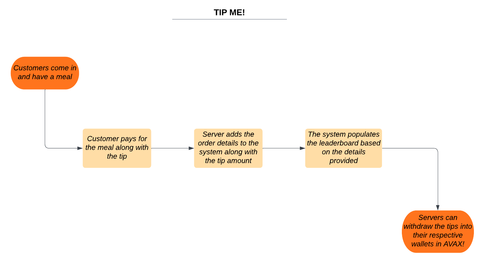
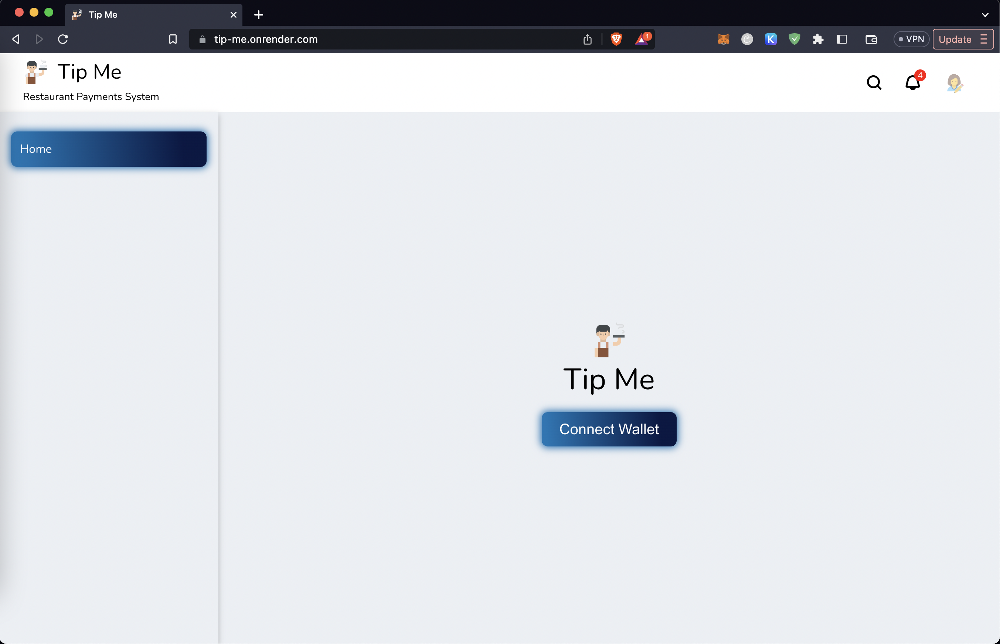
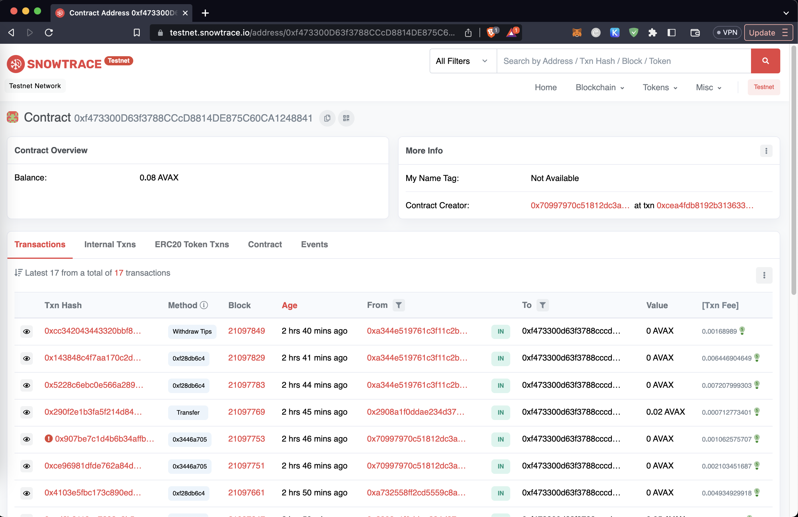
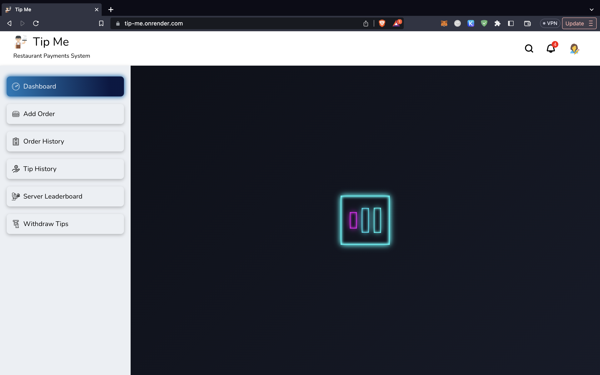
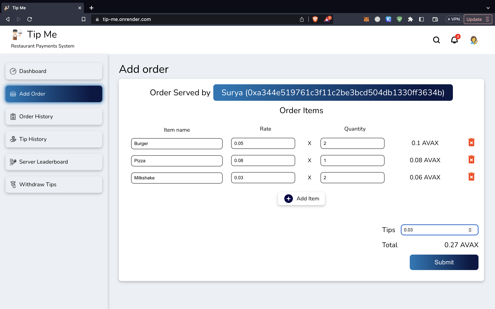
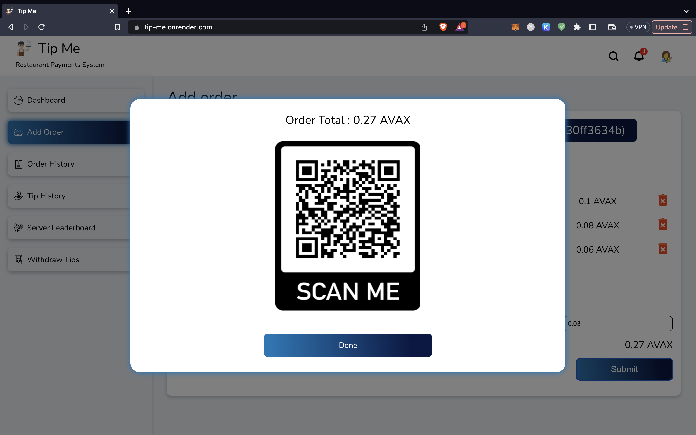
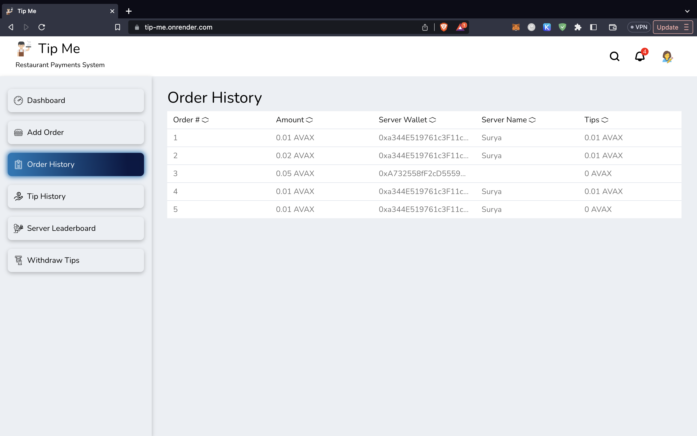
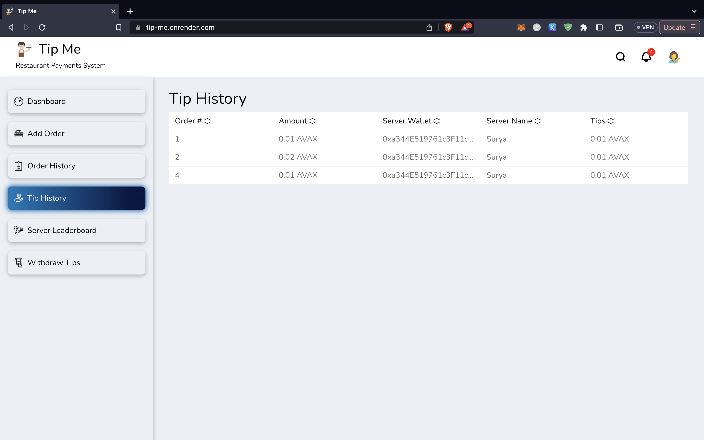
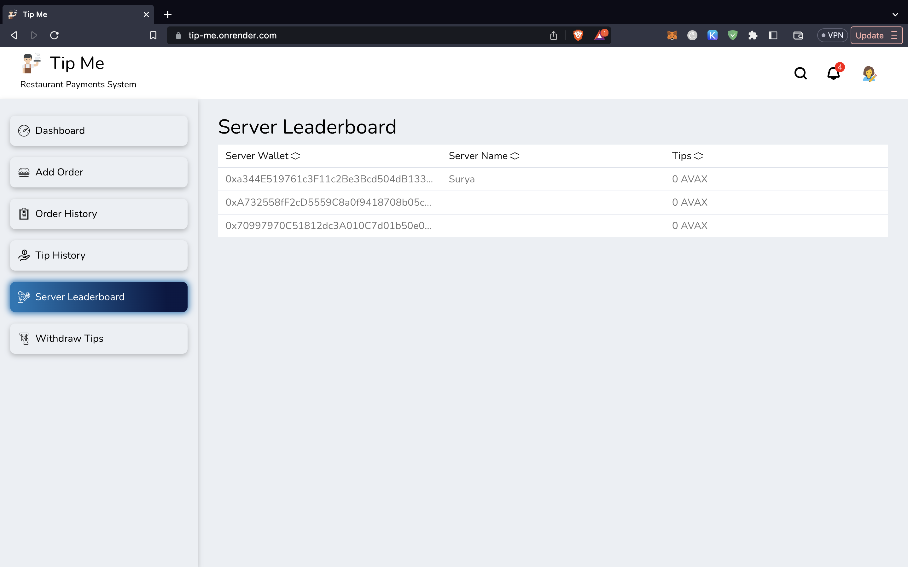
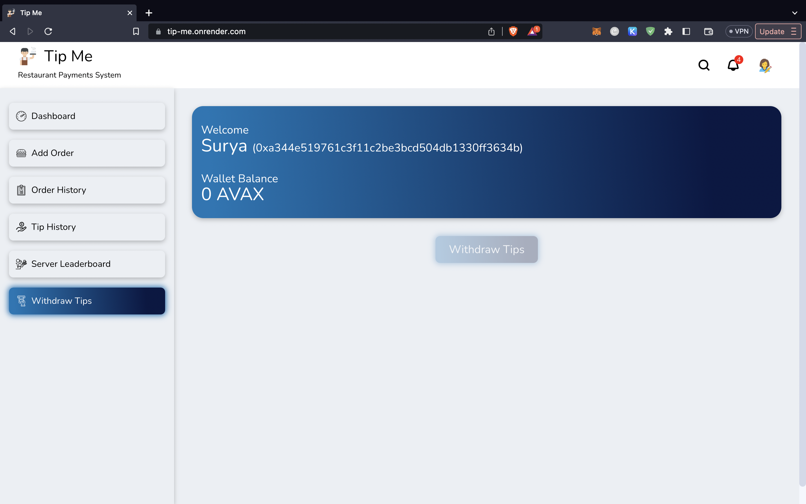

# TIP ME v2.0 - Restaurant Payment Solution based on Avalanche!

A decentralized system for restaurants to collect payments from customers and payout tips to the servers in AVAX!

## PROBLEM STATEMENT

Restaurants and the servers that work there currently face two main challenges in the business.

1. The system that is currently used by restaurants is heavily dependant on payment mediums such as VISA, MasterCard, Interac and such. These intermediaries levy a hefty charge for using their system to process payments on each transaction. For every transaction that these intermediaries process, the restaurant ends up giving a percent of the transaction value to them. This dependancy on such systems tends to take away a considerable chunk of profits that these restaurants make.

2. In the current scenario, we have seen that the tipping system is flawed. When we say flawed, it means that the server works the whole day, serve the customers, get tipped and at the end of the day when it's time to collect their wages, it gets split amongst all the servers. We think this is unfair. When a certain server who is excellent at their work and manages to get more tips as compared to others who may not be so good with their customers ends up having to split their share with the rest seems wrong. The server has earned the tip because of their exceptional service. We are here to change how this works.

## GOALS

Our goal is to create a decentralized web portal which facilitates order management for the restaurant and tip management for the servers as they are able to login to the system, log their orders along with the tips they received & withdraw the total tip they have accumulated in AVAX.

## WHY AVALANCHE?

The reason we chose to use Avalanche over other blockchain platforms is quite simple.

- Avalanche is a blockchain that works on top of Ethereum which therefore enables it to harness the functionality that the Ethereum Blockchain provides.
- It also provides the users with one of the lowest transaction costs associated with blockchain as well as higher turn around time
  with regards to processing transactions.
- The consensus mechanism that Avalanche uses makes it energy efficient and therefore produces a lower carbon footprint and help protect the environment!

## STAKEHOLDERS

- Customers: These include the people who are here at the restaurant to have their meal. They act as the soruce of revenue for the restaurant and tips for the servers.
- Servers: They are the entities who will be using the platform to log the orders and process the payments as well as withdraw the tip amount as and when required.
- Management: This includes the manager & the owner of the restaurant i.e. the client for whom the system is made.
- Developers: These are the individuals or teams responsible for building and maintaining the application.

## RESTRICTIONS/RULES

- Some countries may have strict regulations on the use of cryptocurrency as a mode of payment. In such a case, the use of Ether will have to be substituted with that of a Fiat currency.
- The servers are restricted to adding only the orders they have served. They will not be able to add for others as they have to login to the system using their Metamask wallet.
- This system has been built as a standalone system at this point and is not linked to any legacy system of a restaurant, we for the purpose of this project are required to add some AVAX tokens in the contract while deploying it in order to pay the servers their tips in AVAX.
- Adding to the previous point, due to the lack of a legacy system, we have made the provision for adding the details of the order & tip manually in the system. However, in a real world scenario, this provision will be eliminated with the use of a legacy system linked to this application where all the order details will be populated using the Order ID.

## DATA

- There is no need to store any Personally Identifiable Information of the servers.
- All the orders fulfilled by the restaurant is stored on the blockchain once the customer is done with the payment.
- Server's Wallet Address data is stored on blockchain along with the tips they have so far accumulated.
- We are also storing the individual order data in order to back trace and have a history of orders served in a period.
- Other than that, we are not storing any data off-chain as the data size is well within the on-chain limit.

## USER STORY

1. A server takes the orders from the customers and serves them the food.
2. The server goes to the Tip Me system and logs the order for the customers.
3. Impressed by the quality of service provided by the server, the customers pays for the meal and provides a generous tip to the server.
4. Upon submitting the order, the server sees that they are on the top of the Waiters Leaderboard.
5. She serves many other customers and the tips keep on adding to her balance.
6. At the end of the shift, she sees that she has managed to accumulate a substantial amount of tip in the system.
7. She therefore thinks of withdrawing the balance to her Metamask Wallet.
8. She then proceeds to do so by clicking on the withdraw button and confirming the withdrawal on her Metamask Wallet prompt.
9. In a few minutes she sees the amount deposited in her wallet!

# ARCHITECTURE

### FUNCTIONS - INPUTS/OUTPUTS

#### TipMe CONTRACT

- addWaiter: This function allows the server to add themselves to the system.
- addOrder: This function allows the server to add the order they completed along with the tip amount.
- updateWaiterName: This function allows the server to add thier name in the system to correspond with the wallet address for better reference in the application.
- getWaiters: This function is used to display the servers in the Waiters Leaderboard.
- getOrders: This function is used to display the orders completed in the system.
- withdrawTips: This function is used by the server to withdraw the tips earned by them.
- waiterToTip: This mapping is used to co-relate a particular server with their corresponding tips.
- addressToWaiterName: This mapping is used to co-relate a particular wallet address to the wallet owner (server's) name.
- orderToWaiterName: This mapping is used to link the orders in the system with the name of the server that completed the particular order.
- orderToWaiterAddress: This mapping allows the system to map the orders with the wallet address of the sever that fulfilled the order.

## DIAGRAM (FLOW, SYSTEM)

  

## TECH STACK

- Programming languages: Solidity, Javascript
- Blockchain platform: Avalanche/Ethereum, Fuji C-Chain Testnet

# PROJECT PLAN

## DEPENDENCIES

- NPM
- Vite.js
- React
- Hardhat

# SMART CONTRACT

#### TipMe.Sol (0xf473300D63f3788CCcD8814DE875C60CA1248841 - Fuji C-Chain Testnet)

- Default contract for executing the functions of the program.
- https://testnet.snowtrace.io/address/0xf473300D63f3788CCcD8814DE875C60CA1248841

# HOW TO RUN PROJECT

#### Clone repository

git clone https://github.com/suryapranesh4/Tip-Me  
cd Tip-Me

#### Install dependencies for smart contract

cd smart_contract && yarn
yarn hardhat compile (To compile smart contract and derive the artifacts)
yarn hardhat run scripts/deploy.js --network fuji (To deploy the smart contract to Avalanche Fuji-C test network)

#### Install dependencies for client

cd client && npm install

#### Run the client

npm run dev (Fires the local vite frontend server on port 5173)

#### Client runs on http://localhost:5173 in the browser

## Screenshot of the application

#### Connect wallet screen :  

  

#### Snowflake blockchain explorer - Deployed contract :  

  

#### Server Dashboard :  

  

#### Loading screen :  

  

#### Module for the server to log orders in their name :  

  

#### QR Code linked to smart contract (Restaurant wallet) to facilitate customer to make payments :  

  

#### List of Orders added :  

  

#### Tips received by each server :  

  

#### Server Leaderboard :  

  

#### Module to facilitate server to withdraw tips to their crypto wallet in Avalanche(AVAX) :  

  

